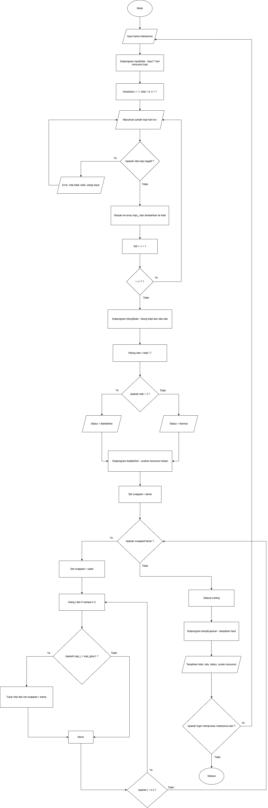

# ☕ SISTEM ANALISIS KONSUMSI KOPI MAHASISWA

Program analisis pola konsumsi kopi berbasis data 7 hari menggunakan C++

## 📊 Status Progres: 100% ✅

**Progres Saat Ini:**
- ✅ 7 Fungsi Modular Selesai
- ✅ Bubble Sort Descending Selesai
- ✅ Logika Status & Rekomendasi Selesai
- ✅ Fitur Mengulang Program Selesai

## 📌 Fitur yang Sudah Selesai

✅ **Array 1 Dimensi** - Penyimpanan data konsumsi 7 hari  
✅ **Input & Validasi** - Input nama dan konsumsi dengan validasi negatif  
✅ **Fungsi Modular** - 7 fungsi terpisah untuk kemudahan maintenance  
✅ **Perhitungan Matematis** - Total dan rata-rata konsumsi  
✅ **Bubble Sort** - Pengurutan data dari tertinggi ke terendah  
✅ **Logika Status** - Penentuan Normal/Berlebihan berdasarkan threshold  
✅ **Rekomendasi Kesehatan** - Saran bertingkat 3 kategori (Sangat Berlebihan, Berlebihan, Normal)  
✅ **Fitur Mengulang** - Do-while loop untuk analisis berulang  
✅ **Tampilan Terstruktur** - Output hasil analisis yang rapi  
✅ **Edge Case Handling** - Validasi input negatif dengan perulangan  

## 🎯 Ketentuan PBL

Program ini dibuat sesuai ketentuan pembelajaran dengan kriteria:
- ✅ Alur Input → Proses → Output
- ✅ Percabangan (if-else untuk validasi & nested if untuk rekomendasi)
- ✅ Perulangan (while, for, nested loop, do-while)
- ✅ Minimal 2 fungsi/prosedur (sudah ada 7 fungsi)
- ✅ Array 1D dengan operasi lengkap (input, baca, copy, swap, tampil)
- ✅ Algoritma Bubble Sort dengan implementasi lengkap
- ✅ Logika status konsumsi (Normal/Berlebihan)
- ✅ Rekomendasi kesehatan bertingkat (3 kategori)
- ✅ Fitur mengulang program (do-while loop)

## 📦 Struktur Data

```cpp
string nama;                    // Nama mahasiswa
int konsumsi[7];               // Data konsumsi 7 hari
int konsumsiAsli[7];           // Backup data sebelum sorting
int total;                     // Total konsumsi
float rataRata;                // Rata-rata per hari
string status;                 // Status konsumsi (Normal/Berlebihan)
char ulang;                    // Input untuk mengulang program (Y/T)
```

## 🔧 Fungsi-Fungsi Utama

| No | Fungsi | Status | Deskripsi |
|----|--------|--------|-----------||
| 1 | `inputData()` | ✅ Selesai | Input nama & konsumsi 7 hari dengan validasi |
| 2 | `hitungTotal()` | ✅ Selesai | Menghitung total konsumsi (return int) |
| 3 | `hitungRataRata()` | ✅ Selesai | Menghitung rata-rata (return float) |
| 4 | `tentukanStatus()` | ✅ Selesai | Menentukan status Normal/Berlebihan (return string) |
| 5 | `tampilkanRekomendasi()` | ✅ Selesai | Rekomendasi kesehatan 3 tingkat (nested if) |
| 6 | `bubbleSort()` | ✅ Selesai | Bubble Sort descending (tertinggi ke terendah) |
| 7 | `tampilkanHasil()` | ✅ Selesai | Menampilkan hasil analisis lengkap dengan status |

## 🚀 Cara Kompilasi & Menjalankan

### **Windows (MinGW/g++)**
```bash
g++ -std=c++17 sistem_konsumsi_kopi.cpp -o sistem_konsumsi_kopi.exe
sistem_konsumsi_kopi.exe
```

### **Linux/Mac**
```bash
g++ -std=c++17 sistem_konsumsi_kopi.cpp -o sistem_konsumsi_kopi
./sistem_konsumsi_kopi
```

### **VS Code (dengan task)**
```bash
Tekan Ctrl+Shift+B → pilih "build and run"
```

## 📖 Alur Program

```
1. Input Nama Mahasiswa           ✅ Berfungsi penuh
2. Input Konsumsi 7 Hari          ✅ Berfungsi penuh (dengan validasi)
3. Hitung Total & Rata-rata       ✅ Berfungsi penuh
4. Tentukan Status Konsumsi       ✅ Berfungsi penuh
5. Bubble Sort (Descending)       ✅ Berfungsi penuh
6. Tampilkan Hasil Analisis       ✅ Berfungsi penuh
7. Rekomendasi Kesehatan 3 Tingkat ✅ Berfungsi penuh
8. Mengulang Program (Do-While)   ✅ Berfungsi penuh
9. Pesan Penutup                  ✅ Berfungsi penuh
```

## 💡 Contoh Penggunaan

### **1. Input Data & Analisis**
```
========================================
  SISTEM ANALISIS KONSUMSI KOPI MAHASISWA
========================================

Masukkan nama mahasiswa: Budi Santoso

Masukkan konsumsi kopi (cangkir) per hari:
Hari ke-1: 2
Hari ke-2: 4
Hari ke-3: 1
Hari ke-4: 5
Hari ke-5: 3
Hari ke-6: 2
Hari ke-7: 3

========================================
          HASIL ANALISIS
========================================
Nama Mahasiswa    : Budi Santoso
Total Konsumsi    : 20 cangkir
Rata-rata/Hari    : 2.86 cangkir
Status Konsumsi   : Normal
========================================

Konsumsi per hari (terurut tertinggi ke terendah):
1. 5 cangkir
2. 4 cangkir
3. 3 cangkir
4. 3 cangkir
5. 2 cangkir
6. 2 cangkir
7. 1 cangkir

========================================
       REKOMENDASI KESEHATAN
========================================
STATUS: NORMAL

INFORMASI:
- Konsumsi kopi Anda masih dalam batas wajar
- Tetap jaga pola konsumsi yang sehat
- Batas aman: maksimal 3 cangkir per hari

TIPS SEHAT:
- Hindari kopi saat perut kosong
- Imbangi dengan air putih yang cukup
- Jangan minum kopi menjelang tidur
========================================

Apakah ingin menganalisis data lain? (Y/T): T

========================================
   Terima kasih telah menggunakan
   Sistem Analisis Konsumsi Kopi!
   Jaga kesehatan Anda!
========================================

Tekan Enter untuk keluar...
```

### **2. Validasi Error (Edge Case)**
```
Masukkan nama mahasiswa: Andi Wijaya

Masukkan konsumsi kopi (cangkir) per hari:
Hari ke-1: 3
Hari ke-2: -2
Error: Data tidak valid, ulangi input!
Hari ke-2: 4
Hari ke-3: 2
Hari ke-4: 0
Hari ke-5: -5
Error: Data tidak valid, ulangi input!
Hari ke-5: 3
Hari ke-6: 5
Hari ke-7: 1

✓ Input berhasil! Validasi berfungsi dengan baik.
```

### **3. Konsumsi Berlebihan**
```
Masukkan nama mahasiswa: Andi Wijaya

Masukkan konsumsi kopi (cangkir) per hari:
Hari ke-1: 4
Hari ke-2: 5
Hari ke-3: 3
Hari ke-4: 6
Hari ke-5: 4
Hari ke-6: 5
Hari ke-7: 4

========================================
          HASIL ANALISIS
========================================
Nama Mahasiswa    : Andi Wijaya
Total Konsumsi    : 31 cangkir
Rata-rata/Hari    : 4.43 cangkir
Status Konsumsi   : Berlebihan
========================================

Konsumsi per hari (terurut tertinggi ke terendah):
1. 6 cangkir
2. 5 cangkir
3. 5 cangkir
4. 4 cangkir
5. 4 cangkir
6. 4 cangkir
7. 3 cangkir

========================================
       REKOMENDASI KESEHATAN
========================================
STATUS: BERLEBIHAN

PERHATIAN:
- Konsumsi kopi Anda melebihi batas aman
- Mulai kurangi konsumsi secara perlahan
- Risiko: gangguan tidur, ketergantungan kafein

SARAN:
- Batasi maksimal 3 cangkir per hari
- Perbanyak minum air putih
- Kurangi kopi di malam hari
========================================

Apakah ingin menganalisis data lain? (Y/T): Y
```

## ⚠️ Edge Cases yang Ditangani

| Situasi | Respons Program | Status |
|---------|----------------|---------|
| Input negatif | ❌ ERROR: Data tidak valid, ulangi input! | ✅ Berfungsi |
| Input 0 | ✓ Diterima (valid) | ✅ Berfungsi |
| Input berulang kali negatif | Loop terus sampai input valid | ✅ Berfungsi |
| Nama kosong | Diterima (getline) | ✅ Berfungsi |

## 📊 Algoritma yang Sudah Diimplementasi

### **Bubble Sort** ✅
- **Kompleksitas:** O(n²)
- **Digunakan di:** Fungsi `bubbleSort()` (baris 95-105)
- **Cara Kerja:** Nested loop membandingkan elemen berdekatan dan swap jika salah urutan
- **Fungsi:** Mengurutkan data konsumsi dari tertinggi ke terendah (descending)

### **Validasi Input dengan While Loop** ✅
- **Kompleksitas:** O(n) - worst case jika semua input invalid
- **Digunakan di:** Fungsi `inputData()` (baris 15-24)
- **Cara Kerja:** Loop akan terus meminta input sampai data valid (>= 0)
- **Fungsi:** Mencegah input negatif masuk ke array

### **Logika Status (If-Else)** ✅
- **Kompleksitas:** O(1)
- **Digunakan di:** Fungsi `tentukanStatus()` (baris 38-44)
- **Cara Kerja:** Percabangan sederhana membandingkan rata-rata dengan threshold 3
- **Fungsi:** Menentukan status Normal atau Berlebihan

### **Rekomendasi Kesehatan (Nested If)** ✅
- **Kompleksitas:** O(1)
- **Digunakan di:** Fungsi `tampilkanRekomendasi()` (baris 46-93)
- **Cara Kerja:** Nested if-else dengan 3 kategori berdasarkan tingkat konsumsi
- **Fungsi:** Memberikan rekomendasi spesifik (Sangat Berlebihan >5, Berlebihan >3, Normal ≤3)

### **Do-While Loop** ✅
- **Kompleksitas:** O(1) per iterasi
- **Digunakan di:** Fungsi `main()` (baris 133-167)
- **Cara Kerja:** Program dijalankan minimal 1x, kemudian user pilih mengulang atau tidak
- **Fungsi:** Mengulang analisis tanpa restart program


## 📊 Flowchart Program



*Flowchart menunjukkan alur kerja sistem dari input hingga output hasil analisis dengan sorting.*

## 📁 File dalam Project

```
PBL-Alprog/
├── Flowchart/
│   └── FlowDeteksiKopiMahasiswa.png   # Diagram alur program
├── sistem_konsumsi_kopi.cpp           # File program utama (100% selesai)
├── sistem_konsumsi_kopi.exe           # File executable hasil compile
└── README.md                          # File ini (overview project)
```

## ✅ Fitur Tambahan yang Diimplementasikan

**Update Terbaru (100% Selesai):**
1. ✅ Fungsi `tentukanStatus()` - Logika penentuan Normal/Berlebihan
2. ✅ Fungsi `tampilkanRekomendasi()` - Sistem rekomendasi 3 tingkat:
   - Sangat Berlebihan (rata-rata > 5 cangkir)
   - Berlebihan (rata-rata > 3 cangkir)
   - Normal (rata-rata ≤ 3 cangkir)
3. ✅ Do-While Loop - Fitur mengulang program dengan input Y/T
4. ✅ Status ditambahkan ke tampilan hasil
5. ✅ Pesan penutup yang ramah
6. ✅ Pause sebelum keluar program

**Peningkatan dari Versi Sebelumnya:**
- ⬆️ Progres: 70% → 100%
- ⬆️ Jumlah fungsi: 5 → 7 fungsi
- ⬆️ Percabangan: If-Else → Nested If-Else (3 tingkat)
- ⬆️ Perulangan: While, For → While, For, Nested For, Do-While
- ⬆️ User Experience: Lebih interaktif dengan rekomendasi personal

## 👨‍💻 Informasi Developer

- **Proyek:** PBL - Sistem Analisis Konsumsi Kopi Mahasiswa
- **Bahasa:** C++
- **Standard:** C++17
- **IDE:** VS Code / Code::Blocks / Dev-C++
- **Institusi:** Universitas Negeri Yogyakarta (UNY)

## 📄 Lisensi

Program ini dibuat untuk keperluan pembelajaran PBL (Project Based Learning).

---
